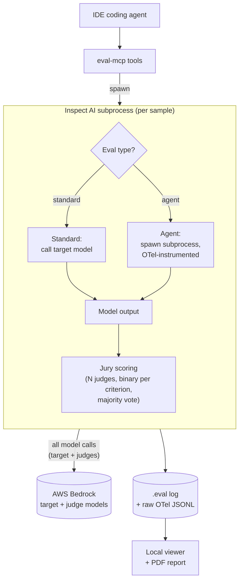
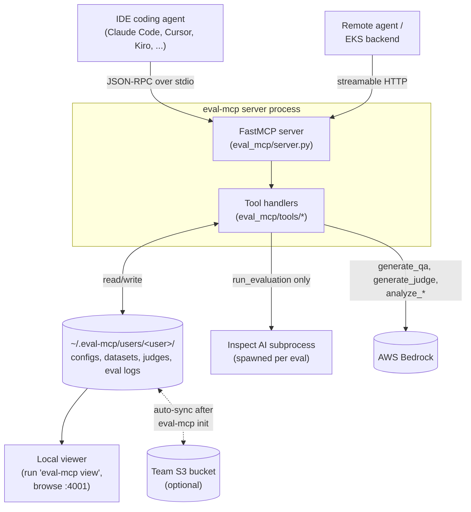
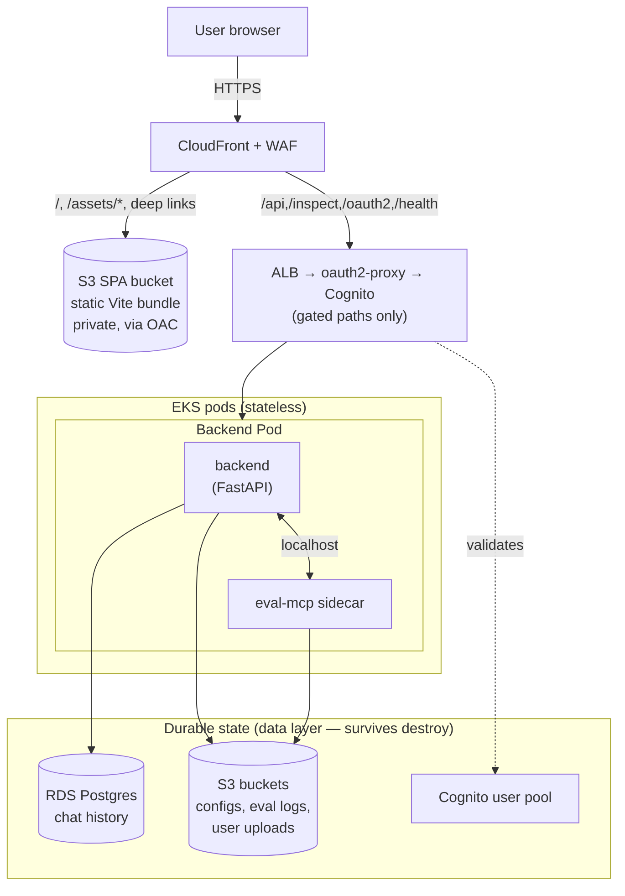

# Architecture

Three diagrams covering the three distinct ways code in this repo runs:

1. **[Eval execution](#1-eval-execution)** — what actually happens when a user says "evaluate this." End-to-end from MCP tool call through Inspect AI, Bedrock, the jury of judges, and back into the viewer.
2. **[MCP server](#2-mcp-server)** — how the `eval-mcp` package is wired: transports, tool surface, storage, the local viewer, optional S3 team sharing.
3. **[EKS deployment](#3-eks-deployment)** — the optional multi-user web app: CloudFront → ALB → backend pod (with the MCP as a K8s native sidecar) → S3/RDS.

The MCP package (`eval_mcp/`) and the EKS web app (`backend/` + `frontend/` + `helm/` + `infra/`) are independently deployable. The web app embeds the MCP as a sidecar in the backend pod — that's the one place the two intersect.

---

## 1. Eval execution

**Tool order in a typical session:** `list_bedrock_models` → `generate_qa_pairs` (from docs or context) → `save_dataset` → `generate_judge` → `create_eval_config` → `run_evaluation` → `generate_report`. The agent in the IDE picks the order; the MCP just exposes the tools.

**Why subprocess isolation.** `run_evaluation` shells out to `python -m inspect_ai eval` rather than calling Inspect in-process. A cancelled or crashed eval can't take down the MCP, and the subprocess gets a fresh interpreter so OTel instrumentation can be installed cleanly per run.

**How agent evals capture Bedrock calls.** For `agent_path` configs, the solver spawns the agent as a subprocess with `opentelemetry-instrument` autoloaded (via `opentelemetry-distro`) and `OTEL_EXPORTER_OTLP_ENDPOINT` pointed at an in-process OTLP receiver inside the Inspect subprocess. The agent's Bedrock calls emit spans → receiver → ModelEvents in the `.eval` log. A pre-flight canary in `eval_mcp/canary.py` exercises this path once before the real eval, so a broken capture pipeline fails loudly instead of returning `success=true, scores=[]`. Raw spans are also appended to `logs/raw_otel/<eval_id>.jsonl` as cold storage in case the projection ever drops data.

**Jury scoring.** Multiple judges from different model families (default in `eval_mcp/core/judge_config.py`) each score every sample binary-per-criterion. `backend/core/jury_scoring.py` aggregates: majority vote per criterion, then sample passes if all criteria pass. This is more reliable than single-judge numeric scales ([Mallinar et al., 2025](https://arxiv.org/abs/2503.23339v2)) and reduces self-preference bias ([Lifshitz et al., 2025](https://arxiv.org/abs/2502.20379)).

---

## 2. MCP server

**Transport.** `eval_mcp/server.py:main()` reads `EVAL_MCP_TRANSPORT` — defaults to `stdio` (what IDEs use), set to `http` to serve `streamable_http_app` at `EVAL_MCP_PORT` (default 8002) for self-hosted / EKS-sidecar use. Same server, same tools, different mouth.

**Tool registration.** Every tool is registered in `server.py` with a typed signature and an annotation preset (`READ_LOCAL`, `READ_REMOTE`, `CREATE_LOCAL`, `CREATE_REMOTE`, `RUN_REMOTE`). The docstring on the registered function is the description the LLM sees — keep it specific about ID formats, prerequisites, and failure modes.

**Storage.** All persistent state lives under `~/.eval-mcp/users/<user>/` (overridable via `USER_STORAGE_BASE` — the EKS deployment sets this to `/data/users` on an emptyDir mount). Filesystem layout per user: `configs/`, `datasets/`, `judges/`, `logs/`. `EVAL_MCP_USER` (default `local`) selects the user namespace for standalone runs.

**Team sharing.** `eval-mcp init <bucket>` writes the bucket to local config; from then on every write fires `replicate_async` into a thread pool, and every list/read calls `auto_pull` (debounced by TTL) so local state mirrors S3. Account-ID suffix is auto-resolved so teammates type the same short name. Bucket region is auto-detected via `head_bucket` even on cross-region 301 redirects.

**Viewer.** `eval-mcp view` boots a FastAPI app that serves the pre-built Vite/React SPA from `eval_mcp/viewer_static/` (mounts `/assets`, with an `index.html` SPA fallback for client-routed paths). The static bundle is package data per `pyproject.toml`, so rebuilding the frontend (`npm run build:viewer`) affects the published wheel.

**Installers.** `eval_mcp/installers/` has one module per IDE. The dispatcher in `cli.py:install` auto-detects which IDEs are present, asks which to register, and writes the right config in each (JSON merge for Claude Code / Cursor / VS Code / Kiro, TOML round-trip for Codex via `tomlkit` so user comments survive).

---

## 3. EKS deployment

The optional multi-user web app — Cognito-auth'd chat UI for non-technical users. Two Terraform layers with independent state; `deploy.sh` orchestrates both.

**Frontend serving — static SPA on S3, no frontend pod.** The frontend is a static Vite/React SPA (no Node runtime). CloudFront serves it from a **private S3 bucket via Origin Access Control (OAC)** — the bucket is fully private and readable only by this distribution. CloudFront splits traffic by path: `/`, `/assets/*`, and SPA deep links (`/chat`, `/history`, …) come from S3; the gated paths (`/api/*`, `/inspect/*`, `/oauth2/*`, `/health`) go to the ALB → oauth2-proxy → backend. A small **CloudFront Function** (viewer-request) rewrites extension-less, non-API paths to `/index.html` for client-side routing (it never touches the gated prefixes). The **default behavior is S3** (static is the catch-all), mirroring the local nginx model in `make dev`. There is no frontend pod — only `backend` + `oauth2-proxy` run in the cluster. The public-facing surface is a credential-free bucket, not a process; the credentialed backend is reachable only through oauth2-proxy. SPA deploy is `npm run build` → `aws s3 sync` → CloudFront invalidation (in `buildspec-scripts/deploy.sh`), not a Docker image.

The `Edge` collapses several AWS services (CloudFront, WAF, an internal ALB, oauth2-proxy on EKS, Cognito as the IdP) into one logical boundary — they exist, but they're not architecturally interesting beyond "authenticated HTTPS gateway." Same for the physical S3 buckets and three Bedrock regions, which collapse into single tiles. The depth lives in the prose below.

**Two Terraform layers, independent state.**

- `infra/data/` — VPC (2 AZs, public/private/intra subnets, NAT, S3 VPC endpoint), RDS Postgres (db.t3.micro, 20→100GB, IAM auth), three S3 buckets (documents + data + the private SPA bucket), and the **Cognito user pool + hosted-UI domain**. Survives `./destroy.sh`. The Cognito *pool* lives here (not platform) because it holds user accounts — irreplaceable state like RDS rows — so a platform teardown preserves users (and the per-user data keyed by Cognito `sub`).
- `infra/platform/` — EKS 1.34 (2× t4g.medium managed node group), Karpenter for autoscaling, internal ALB, CloudFront + WAF + the SPA OAC/origin/function/bucket-policy, the Cognito **client** + hosted-UI CSS + optional OIDC IdP (per-deployment, references CloudFront), CodeBuild + ECR, ESO + Pod Identity, multi-region Bedrock logging (`us-west-2`, `us-east-1`, `us-east-2`). Destroyed and recreated by deploy/destroy.

Layers connect via `-var=` flags (not `terraform_remote_state`) so platform state never sees data-state secrets. `deploy.sh` reads the data outputs (VPC/RDS/buckets/Cognito pool) and passes them in explicitly.

> **Applying the Cognito-in-data-layer change to a pre-existing stack** (one whose pool is still in the *platform* state) requires a one-time `terraform state mv` of `aws_cognito_user_pool.main` / `aws_cognito_user_pool_domain.main` from platform → data **before** `deploy.sh`, or terraform will destroy the live pool (wiping users). Fresh deploys are unaffected.

**Why the ALB is internal.** Only CloudFront can reach it, via [VPC Origins](https://docs.aws.amazon.com/AmazonCloudFront/latest/DeveloperGuide/private-content-vpc-origins.html) over the AWS private network. The internet never sees the ALB directly — defense in depth on top of WAF.

**Why backend is stateless.** `helm/eval/templates/pvc.yaml` is intentionally empty (see its comment). All durable state goes to S3; pod-local `/data` is `emptyDir`, lost on restart. Chat history is in RDS. This means a pod restart is harmless and HPA scaling Just Works — different from the old EBS-PVC design referenced in some older docs.

**MCP as a sidecar.** The backend Deployment runs two containers in one Pod: `backend` (FastAPI) and `eval-mcp` (HTTP transport on :8002, declared as a K8s 1.28+ native sidecar via `initContainers` with `restartPolicy: Always`). Backend reaches the MCP at `http://localhost:8002/mcp` (the `EVAL_MCP_URL` env var). They share the `/data` emptyDir, so anything the MCP writes is visible to the backend in the same pod.

**Routing** — CloudFront splits by path between the S3 origin and the ALB origin (per `infra/platform/cloudfront.tf`); the ALB then routes per `alb.tf` + Helm values:

| Path                       | Origin / Service          | Auth                |
|----------------------------|---------------------------|---------------------|
| `/`, `/assets/*`, deep links | S3 (CloudFront OAC)       | public (no data)    |
| `/api/*`                   | ALB → oauth2-proxy → backend | oauth2-proxy     |
| `/inspect/*`               | ALB → oauth2-proxy → backend | oauth2-proxy     |
| `/oauth2/*`                | ALB → oauth2-proxy        | public              |
| `/health`                  | ALB → backend             | public (inert)      |

CloudFront's **default behavior is the S3 origin**; the gated paths above are explicit higher-priority behaviors → ALB. The only ALB rule pointing directly at the backend target group is `/health` (its handler ignores the identity header), so every authenticated request transits oauth2-proxy — which sets `X-Forwarded-User` from the validated Cognito session and strips any client-supplied copy. oauth2-proxy has a single backend upstream (`http://backend:8080/`).

**Secrets.** Everything sensitive is in Secrets Manager; External Secrets Operator syncs it into K8s Secrets via Pod Identity. Database auth uses RDS IAM tokens — no static passwords anywhere.
