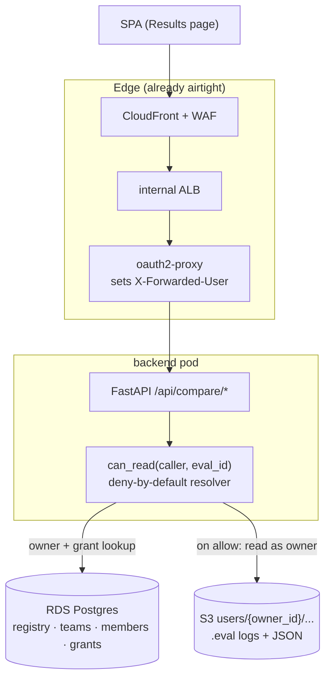

# Design: cross-user eval sharing (web app)

Status: **implemented (all phases 0–4)** · Scope: **EKS web app only** (`backend/` + `frontend/` + `helm/` + `infra/`) · Applies to: multi-user Cognito deployment, **not** the local MCP package

> **Implementation note (all phases shipped).** Grants key on the composite `(owner_id, group_id)` rather than a separate minted `eval_id` registry — `owner_id` supplies the uniqueness `group_id` (Inspect's `run_id`) lacks, which delivered the same authorization guarantees without the storage-layer refactor of phase 0. The owner travels with each request as a hint (`?owner=`), and is always re-authorized server-side via the resolver. Phases delivered: user→user + share-all (`eval_grants`), teams (`teams`/`team_members` + `/api/teams`), org-wide (`org` principal), the Inspect raw viewer (`inspect_viewer.py` grant-aware `can_read`/`can_list`, read-only), and chat/MCP (backend-injected `shared_scopes`). The `eval_mcp/` package stays DB-free — all grant resolution lives in `backend/`.
>
> **Multi-resource sharing.** The same grant model was then generalized beyond evals to **datasets, judges, optimizations, and documents** via a `resource_type` column on `eval_grants` (folded into the deterministic grant-id hash so a dataset and an eval with the same `group_id` never collide). The resolver's `can_read`/`list_shared_scopes` take a `resource_type`; each read route resolves the owner with its type; the MCP list tools (`list_datasets`/`list_judges`/`list_optimizations`/`list_documents`) receive type-scoped `shared_scopes`. A shared **`ShareModal`** + a per-type `/shares` router (`backend/api/sharing_routes.py`) keep the surface DRY. **Cascade** (`backend/core/sharing_cascade.py`): sharing an optimization also grants its referenced dataset, judge, and per-iteration eval logs (resolved in the owner's namespace); sharing an eval cascades its config's dataset/judge. Documents are path-keyed so they support **share-all only**. Route-ordering caveat: the static `/api/<type>/shares` routers are registered **before** the dynamic `/{id}` detail routes so they win FastAPI's in-order match.

This document specifies how one web-app user shares their evaluation results with another user — progressively, from person-to-person up to teams and the whole org — under the first user's permission and read-only. It is grounded in the authorization primitives this repo already ships (the PR #106 tenant-isolation fix) and in OWASP / NIST guidance for access control.

> **Out of scope.** The standalone `eval-mcp` PyPI package has no database and stays single-user; its only "sharing" is the S3 `projects/` broadcast prefix (`eval_mcp/s3_sync.py`), a separate mechanism. Teams/org sharing is inherently a server-side, multi-user concept and lives only in the web app.

---

## 1. Why this is non-trivial today

Today every read is scoped by **one `user_id`** (the `X-Forwarded-User` header from oauth2-proxy) that becomes a storage path/prefix `users/{user_id}/...`. Ownership and storage location are welded together. Two structural facts make naive sharing unsafe:

1. **`group_id` is not globally unique.** It is Inspect AI's `run_id` (or a filename fallback) — `eval_mcp/core/eval_results.py:261`. Two users can hold the same `group_id`; isolation comes purely from the path prefix. A sharing grant keyed on `group_id` alone is ambiguous.
2. **The groups list is one JSON blob per user** (`_groups.json`) with **no owner field** in any element (`eval_results.py:311`). You cannot hand a viewer the owner's blob — that would leak all of the owner's evals.

The fix is the standard production move: **decouple identity from location.** Give each shareable eval a stable global id and an explicit owner recorded as *data*, then authorize reads against a grant store.

---

## 2. Goals & non-goals

**Goals**
- Read-only sharing: a viewer reads the owner's data in place; bytes never copied, never leave the owner's prefix.
- Progressive scope with **one mechanism**: user → user, user → team, user → org.
- A **single server-side resolver** every read path calls. Deny by default.
- Ship with the same isolation-test rigor as the PR #106 breach fix.

**Non-goals (v1)**
- No write/delete/re-run on shared evals (`role` column reserved for later; only `viewer` is issued).
- No deep inheritance ("share a folder → children inherit recursively"). See §8 — that is the ReBAC trigger, deliberately deferred.
- No changes to the local MCP package.

---

## 3. Architecture: two stores, one resolver

| Concern | Where it lives | New? |
|---|---|---|
| **Authorization** — registry (eval → owner), teams, memberships, grants | **RDS Postgres** (existing `backend/core/database.py`) | New *tables*, same DB instance |
| **Eval data** — `.eval` logs, precomputed JSON, reports | **S3** `users/{owner_id}/...`, unchanged | No change — files don't move |

RDS answers "who can see what" (a join); S3 holds the bytes. The **registry row is the bridge**: it lives in RDS but maps a stable `eval_id` → `(owner_id, run_id)`, i.e. the existing S3 location. Files stay put; only identity becomes queryable.



---

## 4. Schema (added to `init_db()`, `backend/core/database.py:204`)

Idempotent `CREATE TABLE IF NOT EXISTS` blocks, matching existing style (`TEXT` ids, FK to `users(id)`, `TIMESTAMPTZ`, `CHECK` constraints, indexes).

```sql
-- (1) Registry: stable id + explicit owner. Decouples identity from S3 path.
CREATE TABLE IF NOT EXISTS eval_registry (
    eval_id    TEXT PRIMARY KEY,                    -- stable UUID we mint
    owner_id   TEXT NOT NULL REFERENCES users(id),
    run_id     TEXT,                                -- Inspect's old group_id (S3 locator)
    task       TEXT,
    created_at TIMESTAMPTZ NOT NULL DEFAULT NOW(),
    UNIQUE (owner_id, run_id)                        -- owner_id supplies the uniqueness run_id lacks
);
CREATE INDEX IF NOT EXISTS idx_registry_owner ON eval_registry(owner_id);

-- (2) Teams: a team is just another principal.
CREATE TABLE IF NOT EXISTS teams (
    id         TEXT PRIMARY KEY,
    name       TEXT NOT NULL,
    created_by TEXT NOT NULL REFERENCES users(id),
    created_at TIMESTAMPTZ NOT NULL DEFAULT NOW()
);

CREATE TABLE IF NOT EXISTS team_members (
    team_id  TEXT NOT NULL REFERENCES teams(id),
    user_id  TEXT NOT NULL REFERENCES users(id),
    role     TEXT NOT NULL DEFAULT 'member' CHECK (role IN ('admin','member')),
    added_at TIMESTAMPTZ NOT NULL DEFAULT NOW(),
    PRIMARY KEY (team_id, user_id)
);

-- (3) Grants: one row expresses every sharing case.
CREATE TABLE IF NOT EXISTS grants (
    id             BIGSERIAL PRIMARY KEY,
    owner_id       TEXT NOT NULL REFERENCES users(id),   -- whose evals
    resource_id    TEXT,                                  -- eval_id, OR NULL = "all of owner's evals"
    principal_type TEXT NOT NULL CHECK (principal_type IN ('user','team','org')),
    principal_id   TEXT,                                  -- user_id / team_id, OR NULL for 'org'
    role           TEXT NOT NULL DEFAULT 'viewer'
                       CHECK (role IN ('viewer','editor','owner')),
    granted_by     TEXT NOT NULL REFERENCES users(id),
    created_at     TIMESTAMPTZ NOT NULL DEFAULT NOW()
);
CREATE INDEX IF NOT EXISTS idx_grants_principal ON grants(principal_type, principal_id);
CREATE INDEX IF NOT EXISTS idx_grants_owner     ON grants(owner_id);
```

One table, every case:

| Want | Grant row |
|---|---|
| Share eval X with Bob | `resource_id=X, principal_type=user, principal_id=bob` |
| Share eval X with a team | `resource_id=X, principal_type=team, principal_id=team7` |
| Share **all** my evals with a team | `resource_id=NULL, owner_id=me, principal_type=team` |
| Org-wide | `principal_type=org, principal_id=NULL` |

> **Note: `principal_id`/`resource_id` are intentionally NOT foreign keys.** A grantee may not exist in `users` yet (users are created lazily on first hit — `create_user(user_id, user_id)`, `main.py:1136`), and `resource_id=NULL` is the share-all wildcard. The resolver validates existence at read time; deny-by-default makes a dangling principal harmless.

---

## 5. The resolver — deny by default, reuse existing primitives

A **single** `can_read(caller_id, eval_id)` that every read path calls. It **composes** the PR #106 primitives rather than duplicating them.

```python
async def can_read(caller_id: str, eval_id: str) -> Optional[str]:
    """Return the owner_id to read as if caller may read this eval, else None.

    Deny-by-default: returns None unless an explicit owner-match or grant-match
    succeeds. Mirrors UserAccessPolicy.can_list (inspect_viewer.py:87).
    """
    reg = await db.get_registry(eval_id)        # eval_id -> (owner_id, run_id)
    if not reg:
        return None                              # unknown resource -> deny

    owner_id = reg["owner_id"]

    # 1. Ownership fast path.
    if owner_id == caller_id:
        return owner_id

    # 2. Grant path. Resolve caller's principals: self + teams + org.
    principals = {("user", caller_id), ("org", None)}
    for t in await db.get_teams_for_user(caller_id):
        principals.add(("team", t))

    if await db.has_grant(owner_id, eval_id, principals):  # role >= 'viewer'
        return owner_id

    return None                                  # deny
```

Every consuming endpoint then:

```python
owner_id = await can_read(caller_id, eval_id)
if owner_id is None:
    logger.warning(f"[ACCESS] denied {caller_id} -> eval {eval_id}")
    raise HTTPException(status_code=403, detail="Access denied")

# CRITICAL: build the path through the SAFE helper, scoped to the resolved owner.
# A grant can never be leveraged to read OUTSIDE the grantor's own subtree, because
# the path is rebuilt from owner_id via get_user_log_dir (user_storage.py:141) and
# re-validated with _is_within_dir (inspect_viewer.py:42).
detail = load_eval_detail(owner_id, run_id)
```

**Primitives reused as-is (do not reinvent):**

| Primitive | File:line | Role in the resolver |
|---|---|---|
| `get_current_user_id` / `_get_user_id` | `main.py:86`, `compare.py:25` | Caller identity from `X-Forwarded-User` **only** — never client body/query |
| MCP force-injection of `user_id` | `mcp_client.py:351` | Model/client cannot spoof identity in the chat path |
| `_is_within_dir(path, scope)` | `inspect_viewer.py:42` | Separator-anchored boundary — defeats traversal/substring/sibling-prefix |
| `_normalize_key` | `inspect_viewer.py:23` | Strip scheme + collapse `..` before any comparison |
| `safe_user_path` / `get_user_log_dir` | `user_storage.py:53` / `141` | Build owner-scoped path that cannot escape; never string-concat owner id |
| `UserAccessPolicy.can_list` shape | `inspect_viewer.py:87` | The deny-by-default template the resolver mirrors |

**The only genuinely new code is the grant store + lookup.** Boundary checks, identity resolution, spoof-prevention, and path construction already exist.

---

## 6. Read-path chokepoints

Every endpoint that returns eval data must route through `can_read`. Inventory:

| Route / surface | File:line | Class |
|---|---|---|
| `GET /api/compare/groups` | `compare.py:32` | **(a)** easy — list own + granted, tag each with `owner` |
| `GET /api/compare/detail` | `compare.py:42` | **(a)** easy — resolve owner, `load_eval_detail(owner, run_id)` |
| `GET /api/compare/report/*` | `compare.py:162,245` | **(a)** easy — same owner resolution |
| `GET /api/compare/progress` | `compare.py:107` | **(a)** easy |
| `GET /api/compare/sample` | `compare.py:69,84` | **(b) sensitive** — raw `log_file` path; reuse `_is_within_dir` against resolved owner |
| Inspect viewer `/api/log*` | `inspect_viewer.py` policies | **(b) sensitive** — the PR #106 surface; not used by the SPA |
| MCP `list_evaluations` / `get_evaluation_details` / `generate_report` | `eval_mcp/tools/*` | **(c) chat flow** — needs explicit non-injected target param |

**v1 gates category (a) only** — that fully powers the visible Results UI (the SPA rides entirely on `/api/compare/*`; it never links to `/inspect/*` and does not call `/api/compare/sample`). Categories (b) and (c) are explicitly deferred and remain **blocked**, not silently bypassing the check (§8).

---

## 7. Security requirements (acceptance criteria)

Aligned with OWASP Top 10 **A01 Broken Access Control (the #1 risk)** and its prevention bullets, plus this repo's own trust model.

### 7.1 MUST-FIX before ship — in-cluster network isolation

The `X-Forwarded-User` trust boundary is airtight at the **edge** (WAF → internal-only ALB → CloudFront path-split → oauth2-proxy strips client-supplied auth headers) but **has no in-cluster enforcement**:

- Backend Service is `ClusterIP` on `:8080`, binds `0.0.0.0`, and **no NetworkPolicy isolates it** (`helm/eval/templates/service.yaml:13`; the only NetworkPolicy is `agent-pods-deny-internal` for sandbox pods, `infra/platform/sandbox-security.tf:195`).
- **Consequence:** any in-cluster workload can `curl http://backend:8080/api/... -H "X-Forwarded-User: victim"` and impersonate any user. For a feature where this header decides who reads whose data, this is the dominant blast radius.

**Required:**
1. Add a `NetworkPolicy` (or `CiliumNetworkPolicy`) on `app: backend` allowing ingress on `8080` **only from oauth2-proxy pods** + the ALB node CIDR for the `/health` target group (`alb.tf:60`).
2. Pin oauth2-proxy header behavior **explicitly** in `helm/eval/values-aws.yaml` (`skip_auth_strip_headers` / `pass_user_headers`) — today the inbound-strip is an implicit subchart default that a version bump could flip.
3. Keep the `/health` handler strictly identity-free (it is the one direct-to-backend ALB path); add no other routes to that target group.

### 7.2 Deny by default
The resolver returns no-access unless an explicit owner-match or grant-match succeeds. Never "allow unless a deny rule matches." Unknown `eval_id`, unrecognized `role`, empty `caller_id` → deny.

### 7.3 Identity from server, never client
Caller identity comes only from `X-Forwarded-User` (`get_current_user_id`). Only `eval_id` may come from the client. The chat path preserves the force-injection invariant (`mcp_client.py:351`); any shared-eval-in-chat feature adds a **separate, explicitly-resolved target param** — it must not relax the injected `user_id`.

### 7.4 Enforce record ownership via the registry
Reads resolve through `eval_registry.owner_id`, not a client-supplied owner. Path is always rebuilt from the resolved `owner_id` via `get_user_log_dir` and re-validated with `_is_within_dir` — a grant can never read outside the grantor's subtree.

### 7.5 Constrained roles & explicit share-all
`role`/`principal_type` are `CHECK`-constrained enums (no free-text typos failing open). The `resource_id=NULL` "share all" grant auto-includes **future** evals — it MUST be surfaced explicitly in the UI ("Bob can see ALL your evals, including future ones"), be audit-logged, and be revocable.

### 7.6 Audit logging (net-new pattern)
No audit facility exists today; denials currently raise 403 silently. Establish the convention using the repo's `logging.getLogger(__name__)` + bracketed-tag f-string style:
- `logger.info(f"[GRANT] {owner} granted {grantee} {role} on {resource}")` on create/revoke.
- `logger.warning(f"[ACCESS] denied {caller} -> eval {eval_id}")` immediately before every 403.

### 7.7 Isolation testing (mirror PR #106 rigor)
- New `verify_grant_isolation.py` (root, mirroring `verify_tenant_isolation.py`): plant owner A's eval via `docker compose exec backend`; simulate a 2nd identity by hitting backend `:8080` directly with a per-request `X-Forwarded-User` (the nginx stub pins `local-user`). Assert B is **denied ungranted** and **allowed granted**, and that **revoke flips 200 → 403**.
- Plus a stack-free pytest in `tests/` unit-testing the `can_read` decision helper — **CI runs no tests today** (`.github/workflows/publish.yml` only publishes), so the pytest layer is the only one with automated reach.

---

## 8. Future-proofing: RBAC now, ReBAC-compatible by design

Per OWASP / OpenFGA / NIST guidance, relationship-based access (ReBAC: Google Zanzibar, OpenFGA, SpiceDB) is the recommended pattern once you need **deep inherited hierarchies** ("share a folder → all child evals inherit, recursively"). v1 deliberately does **not** need it — the model here is flat (owner → resource → principal).

The grant row `(owner, resource_id, principal_type, principal_id, role)` is already **relationship-shaped** (a subject–relation–object tuple). This is intentional: if inheritance is needed later, the migration is *moving tuples into OpenFGA/SpiceDB*, not rewriting the model. We avoid the "role explosion" anti-pattern (a named role per sharing combination) by keeping grants per-resource. **Do not** adopt OpenFGA infrastructure for v1 — that would be over-engineering for flat sharing.

---

## 9. Rollout — each phase ships independently, none is a rewrite

| Phase | Adds | New behavior |
|---|---|---|
| **0. Identity** | `eval_registry` + backfill (mirror the `/api/compare/rebuild` precompute pattern) | None — caller sees only own evals, now keyed by stable `eval_id` |
| **1. Person-to-person** | `grants` + resolver + share modal (mirror Report button, `ResultsHeader.tsx:111`) + `owner` badge (`RunRail.tsx:206`) + email lookup | Share with a user |
| **2. Teams** | `teams`, `team_members`, team-management UI | Grant to a team — **`grants` table unchanged**, only `principal_type` differs |
| **3. Org** | built-in org principal | Org-wide toggle |
| **4. (deferred, sensitive)** | extend Inspect viewer + `/api/compare/sample` + MCP chat via the same resolver | Shared evals in the raw viewer + chat |

**Phase 0 is the real cost** — minting `eval_id`s, the registry, backfilling existing evals, and migrating the API/frontend from `group_id` to `eval_id` (touches `eval_results.py`, `user_storage.py`, `compare.py`, `RunRail.tsx`, `ComparisonView.tsx`). It is the production-correct foundation; everything after is additive.

**Frontend gap:** no user-discovery endpoint exists today and `users` doesn't store email. Phase 1 needs either a free-text recipient field or (better) storing `X-Forwarded-Email` on login (`create_user` is already called lazily) + a lookup endpoint feeding a picker.

---

## 10. Open questions

1. **Recipient picker** — free-text user id (ships fastest) vs. email-based lookup (friendlier, needs `users.email` + endpoint) vs. full autocomplete directory.
2. **`eval_id` minting** — UUID generated at eval-completion time and written into the registry by the same hook that triggers precompute (`run_eval.py:546`), vs. backfilled lazily on first read.
3. **Backfill strategy** — eager one-shot migration job vs. lazy registry-population on first `groups` read.
4. Whether phase 4 (Inspect viewer / chat sharing) is ever needed, given the SPA Results UI rides entirely on `/api/compare/*`.

---

## References

- PR #106 — tenant-isolation fix; primitives in `backend/core/inspect_viewer.py`, test in `verify_tenant_isolation.py`.
- OWASP Top 10 2021 **A01 Broken Access Control** — deny by default, implement once & reuse, enforce record ownership, log failures.
- OWASP Authorization Cheat Sheet — server-side/centralized enforcement; prefers ABAC/ReBAC; least privilege.
- NIST RBAC FAQ / SP 800-162 (ABAC) — RBAC suits role/SoD; relationship-based access needs constraints beyond core RBAC.
- Google Zanzibar paper / OpenFGA / SpiceDB — ReBAC for hierarchical, inherited, multi-tenant sharing.
